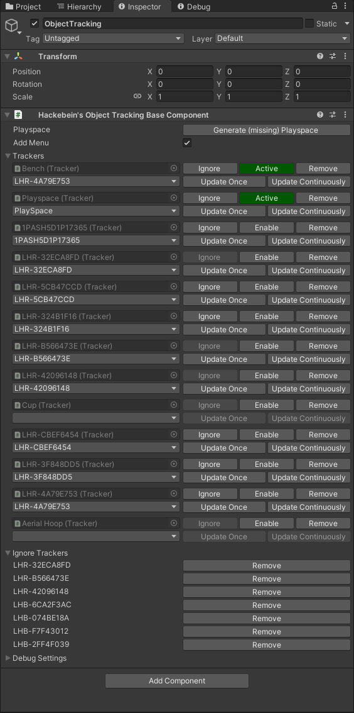
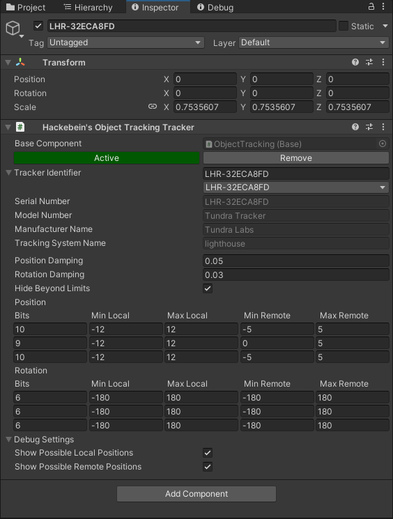

# Hackebein's Object Tracking
Track your real objects and track them in VRChat. All SteamVR/OpenVR supported trackers are supported. [Demo](https://x.com/Hackebein/status/1817729114142343460)

Needs App. Available on:
* [Steam](https://store.steampowered.com/app/3140770) (soon1)
* [Github](https://github.com/Hackebein/Object-Tracking-App/releases)

1 beta keys can be requested via support

Hackebein's VPM Listing: [vpm.hackebein.dev](https://vpm.hackebein.dev)

## Support
* [Hackebein's Research Lab](https://discord.gg/AqCwGqqQmW) at discord.gg

### Project Overview
[Task Overview](https://github.com/users/Hackebein/projects/4)

## Versions
Everything before version 1.0 is to be seen as pre-release.

### Pre-release
Pre-releases are essentially test versions that have undergone less rigorous testing and may contain bugs. These versions have limited compatibility and are typically designed to work only with the latest provided App version.

## Setup
* Add VPM Listing: [vpm.hackebein.dev](https://vpm.hackebein.dev) to VCC
* Add VPM "Hackebein's Object Tracking" to your Project (not "Hackebein's Object Tracking Setup")
* Add Empty Game Object as child to your Avatar
* Add "Hackebein's Object Tracking Base Component" to the GameObject
* Start SteamVR, if it's not running
* Generate (missing) Playspace

### Base Component

Recommendation: Start SteamVR to use live editing tools.
Hint: Wake your Headset up if Tracker are not updating.

#### Transform
Position, Rotation and Scale are frozen.

#### Base Component
**Generate (missing) PlaySpace**: Generates new Game Objects for Trackers which are not on your ignore list.

**In Editor FPS**: Limits/Unlimits FPS in Scene View.

**Add Menu**: Adds Automatic generated Menu.

**Ignore**: Adds Tracker to Ignore list. Ignored Trackers will not be generated by pressing "Generate (missing) PlaySpace".

**Enable/Active**, **Remove**: Proxy buttons from Tracker Component.

**Identifier**-Dropdown: Quick selection

**Update Once**: Updates on next scene draw.

**Update Continuously**: Updates on every scene draw

### Tracker Component

#### Transform
Position and Rotation are controlled by Component if Update Once/Continuously gets applied. Otherwise free to change.
Scale is Real to VR multiplier. Make sure your Real Height in VRChat is set before uploading!

#### Tracker Component

**Enable**: Enables Tracker

**Active**(green): Disables Tracker

**Remove**: Removes Tracker

**Identifier**: Identifier for OSC

**Position Damping**: Smoothes position. Values from 0.00 (0%) to 1.00 (100%)

**Rotation Damping**: Smoothes Rotation. Values from 0.00 (0%) to 1.00 (100%)

**Hide Beyond Limits**: Hides the objects beyond the remote/yellow, as well as beyond the local/red area

## In-Game

### Stabilization Modes

**Stabilization Off**: 

**Stabilization Lazy**: In Lazy Mode an world drop is placed when you stop using your Thumbsticks to move. This is automated. It's not synced for late joiners. Positions can slightly variate.

**Stabilization On**: In On Mode, you take an automated jump or step forward to orientate playspace. It's recommended to not look to far up/down and to not move your head left/right for 1-2s after toggling On.
