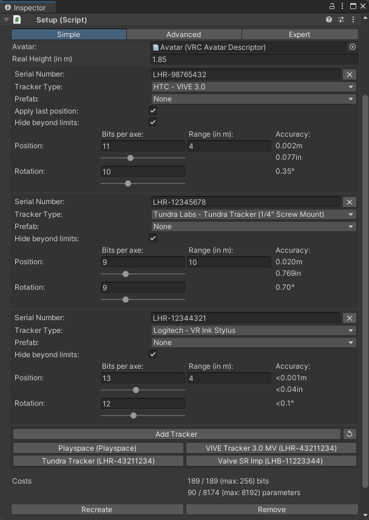

# Hackebein's Object Tracking
Track your real objects and track them in VRChat. All SteamVR/OpenVR supported trackers are supported. [Demo](https://x.com/Hackebein/status/1817729114142343460)

Needs App. Available on:
* [Steam](https://store.steampowered.com/app/3140770) (soon1)
* [Github](https://github.com/Hackebein/Object-Tracking-App/releases)

1 beta keys can be requested via support

Hackebein's VPM Listing: [vpm.hackebein.dev](https://vpm.hackebein.dev)

## Support
* [Hackebein's Research Lab](https://discord.gg/AqCwGqqQmW) at discord.gg

### Project Overview
[Task Overview](https://github.com/users/Hackebein/projects/4)

## Versions
Everything before version 1.0 is to be seen as pre-release.

### Pre-release
Pre-releases are essentially test versions that have undergone less rigorous testing and may contain bugs. These versions have limited compatibility and are typically designed to work only with the latest provided App version.

## Unity Setup Script

### Pre-Setup
* Add VPM Listing: [vpm.hackebein.dev](https://vpm.hackebein.dev) to VCC
* Add VPM "Hackebein's Object Tracking Setup" to your Project
* Add setup component by clicking 
  top-navigation **>** Tools **>** Hackebein **>** Object Tracking Setup
* (Optional) Start SteamVR and connect trackers you like to use

### Quick Setup (simple)
* Avatar: select your avatar 
  _needs to contain Avatar Descriptor component_
* Real height (in m)
* If SteamVR is Running:
  * click reload button
  * click tracker you like to add
* If SteamVR is not Running:
  * click "Add Tracker"
  * Serial Number: Can be obtained in SteamVR System Report 
    _not S/N, which can be printed on your tracker_
  * Tracker Type: Select how the tracker looks in editor
* Prefab: Shows some more information about the prefab after selecting
* Hide beyond limits: Hides the object if it goes beyond maximum range
* Setup your Tracking costs
* Press Create: Tracker gets generated at 0, 0 if "Apply last position" is unchecked
* Align your object inside the object with the same serial number at 1:1 IRL scale

Video: https://youtu.be/oxvaUqVMznQ (made with earlier version)

### Menu Item
#### ObjectTracking/goStabilized
Toggle - stabalize movement if a lot of movement is going on

#### ObjectTracking/isStabilized [Read Only]
Button - shows if stabalization is active

### Debug Menu Item
#### ObjectTracking/isRemotePreview
Toggle - Switches to remote view.

#### ObjectTracking/config/global
Toggle - Resends config to App.
